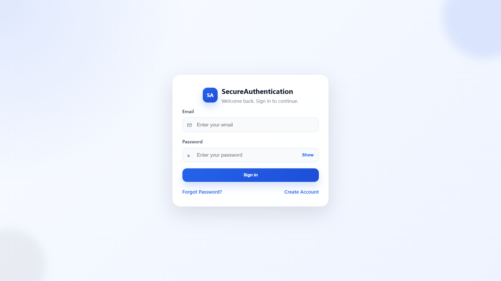
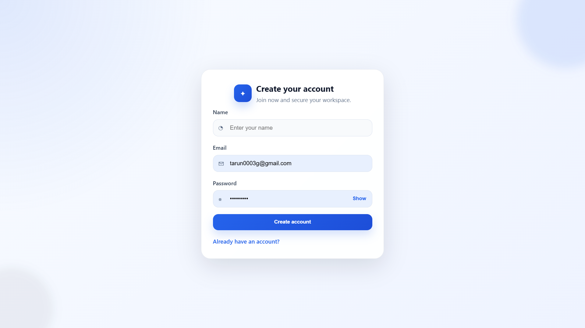
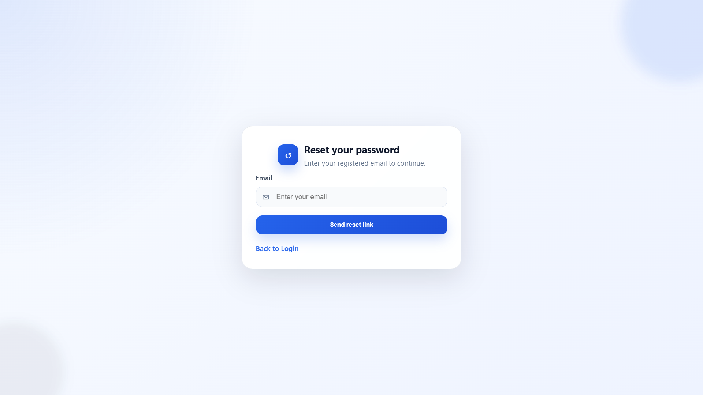
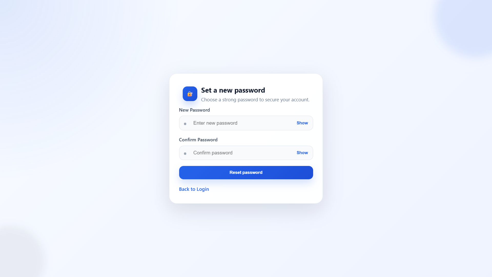
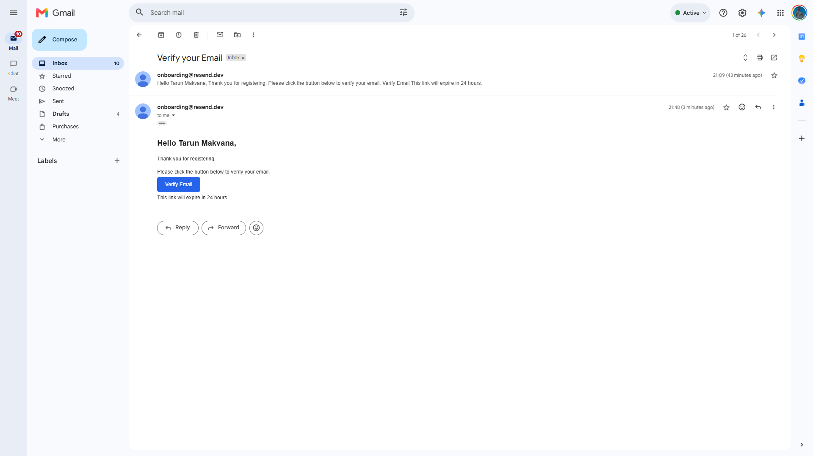
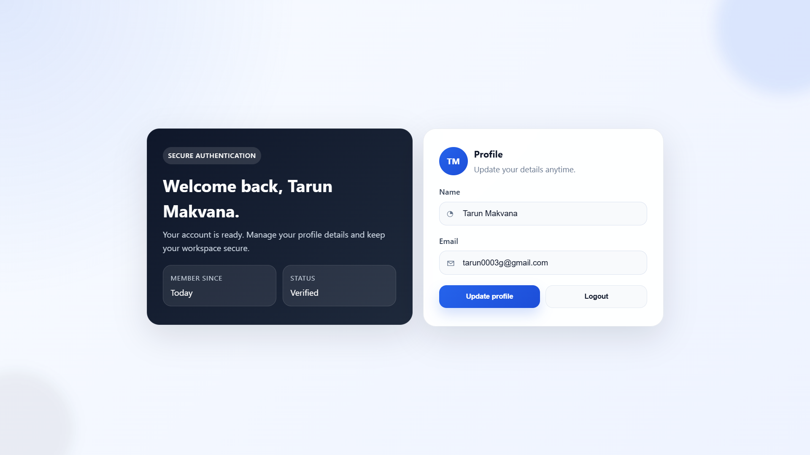

# 🔐 SecureAuthentication

A modern, secure, and full-stack authentication system built using the MERN-inspired stack with **React, Node.js, Express.js, Prisma ORM, PostgreSQL, JWT Authentication, and Resend Email API**.

This project demonstrates a production-ready authentication workflow including **User Registration, Login, Email Verification, Forgot Password, Password Reset, Protected Routes, User Profile Management, and JWT-based Authentication**.

---


# 📷 Screenshots

## 🔑 Login Page


---

## 📝 Register Page


---

## 📧 Forgot Password


---

## 🔒 Reset Password


---

## ✅ Verify Email



---

## 📊 Dashboard


---


## 🚀 Features

### 🔑 Authentication

- User Registration
- User Login
- Secure Logout
- JWT Authentication
- Protected Routes
- Public Routes
- Persistent Login using Context API
- Authentication Middleware

---

### 📧 Email Verification

- Email Verification using Resend API
- Secure Verification Token
- 24-hour Token Expiry
- Verification Link Validation
- Prevent Login Until Email Verification
- Automatic Token Removal After Verification

---

### 🔒 Password Recovery

- Forgot Password
- Secure Password Reset Link
- 1-hour Expiry Token
- Password Reset Page
- Confirm Password Validation
- Secure Password Hashing using bcrypt

---

### 👤 User Profile

- Get Current User
- Update User Profile
- Duplicate Email Validation
- JWT Protected APIs

---

### 🎨 Frontend

- Modern Responsive UI
- Professional Authentication Pages
- React Context API
- React Router DOM
- Axios API Integration
- Responsive Dashboard
- Clean Form Validation
- Loading States

---

### 🛡 Security

- Password Hashing (bcryptjs)
- JWT Authentication
- Protected Backend Routes
- Authentication Middleware
- Email Verification
- Reset Token Expiry
- Token Cleanup After Use
- Secure API Validation

---

# 🛠 Tech Stack

## Frontend

- React.js
- Vite
- React Router DOM
- Context API
- Axios
- CSS3

## Backend

- Node.js
- Express.js
- Prisma ORM
- PostgreSQL
- JWT
- bcryptjs
- Crypto

## Email Service

- Resend API

---

# 📂 Project Structure

```
SecureAuthentication
│
├── client
│   ├── src
│   │   ├── assets
│   │   ├── components
│   │   ├── context
│   │   ├── hooks
│   │   ├── layouts
│   │   ├── pages
│   │   ├── routes
│   │   ├── services
│   │   ├── styles
│   │   ├── utils
│   │   ├── App.jsx
│   │   └── main.jsx
│   └── package.json
│
├── server
│   ├── prisma
│   ├── src
│   │   ├── config
│   │   ├── controllers
│   │   ├── middleware
│   │   ├── routes
│   │   ├── services
│   │   ├── utils
│   │   ├── lib
│   │   └── server.js
│   └── package.json
│
└── README.md
```

---

# ⚙ Installation

## Clone Repository

```bash
git clone https://github.com/tarun0001g/SecureAuthentication.git

cd SecureAuthentication
```

---

## Backend Setup

```bash
cd server

npm install
```

Create `.env`

```env
PORT=5000

DATABASE_URL=your_postgresql_database_url

JWT_SECRET=your_jwt_secret

RESEND_API_KEY=your_resend_api_key

SENDER_EMAIL=your_verified_sender_email
```

Run Prisma Migration

```bash
npx prisma migrate dev

npx prisma generate
```

Start Backend

```bash
npm run dev
```

---

## Frontend Setup

```bash
cd client

npm install

npm run dev
```

Frontend

```
http://localhost:5173
```

Backend

```
http://localhost:5000
```

---

# 🔄 Authentication Flow

```text
User Register
       │
       ▼
Verification Email Sent
       │
       ▼
Verify Email
       │
       ▼
Login
       │
       ▼
JWT Generated
       │
       ▼
Dashboard
       │
       ▼
Protected Routes
```

---

# 🔑 Password Reset Flow

```text
Forgot Password
        │
        ▼
Generate Reset Token
        │
        ▼
Send Email
        │
        ▼
Reset Password Link
        │
        ▼
Create New Password
        │
        ▼
Login Again
```

---

# 📌 API Endpoints

## Authentication

| Method | Endpoint | Description |
|---------|----------|-------------|
| POST | `/api/auth/register` | Register User |
| POST | `/api/auth/login` | Login User |
| GET | `/api/auth/verify-email/:token` | Verify Email |
| POST | `/api/auth/forgot-password` | Forgot Password |
| POST | `/api/auth/reset-password/:token` | Reset Password |

---

## User

| Method | Endpoint | Description |
|---------|----------|-------------|
| GET | `/api/user/profile` | Get Current User |
| PATCH | `/api/user/profile` | Update Profile |

---

# 📖 Learning Outcomes

This project helped me gain hands-on experience with:

- Full Stack Development
- React Context API
- JWT Authentication
- Protected Routes
- REST APIs
- Prisma ORM
- PostgreSQL
- Password Hashing
- Email Verification
- Password Reset Flow
- Authentication Middleware
- API Integration using Axios
- Production-Level Authentication Flow

---

# 🚀 Future Improvements

- Profile Picture Upload
- Change Password
- Refresh Token Authentication
- Google OAuth Login
- GitHub OAuth Login
- Two-Factor Authentication (2FA)
- Role-Based Authentication
- Admin Dashboard
- Account Settings
- Session Management

---

# 👨‍💻 Author

**Tarun Makavana**

B.E. Information Technology

Shantilal Shah Engineering College, Bhavnagar

GitHub: https://github.com/tarun0001g

LinkedIn: https://www.linkedin.com/in/tarun-makavana-52601427a/

---

# ⭐ Support

If you found this project helpful, consider giving it a ⭐ on GitHub.

It motivates me to build more open-source projects.

---

# 📜 License

This project is created for educational and learning purposes.